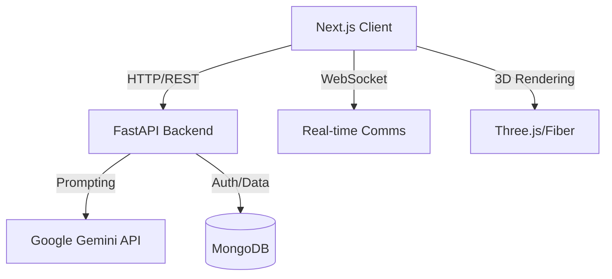
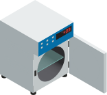

# 🧪 Elixra - The AI-Powered Chemistry Lab

<div align="center">
  
  <br />
  <h3>Immersive Chemistry Education Platform</h3>
  
  [](https://nextjs.org/)
  [](https://fastapi.tiangolo.com/)
  [](https://deepmind.google/technologies/gemini/)
  [](https://www.mongodb.com/)
</div>

---

## 📑 Table of Contents
- [Overview](#-overview)
- [Key Features](#-key-features)
- [Architecture](#-architecture)
- [Project Structure](#-project-structure)
- [Installation & Setup](#-installation--setup)
- [Configuration](#-configuration)
- [API Documentation](#-api-documentation)
- [Virtual Lab Equipment](#-virtual-lab-equipment)
- [Contributing](#-contributing)
- [License](#-license)

---

## 🔭 Overview

**Elixra** is a next-generation educational platform that bridges the gap between theoretical chemistry and practical application. By leveraging **Google's Gemini AI**, 3D visualization technologies, and gamified learning paths, Elixra provides students with a safe, interactive, and intelligent environment to master complex chemical concepts.

### Value Proposition
- **Safe Experimentation**: Perform dangerous or costly reactions in a risk-free virtual environment.
- **Personalized Tutoring**: **ERA (Elixra Reactive Assistant)** provides real-time, context-aware guidance tailored to the student's learning pace.
- **Visual Learning**: Interact with 3D molecular structures and simulated lab equipment to build intuitive understanding.

---

## 🚀 Key Features

| Feature | Description |
|:---:|:---|
|  <br> **Virtual Lab** | Interactive workbench with realistic equipment physics and chemical reaction simulations. |
|  <br> **AI Tutor (ERA)** | Intelligent assistant for Q&A, experiment guidance, and concept explanation. |
|  <br> **Adaptive Quizzes** | Dynamic question generation (MCQ, Reactions) with detailed performance analysis. |
|  <br> **3D Molecules** | Interactive 3D viewer for atomic structures, bonding, and molecular geometry. |
|  <br> **Collaboration** | Real-time collaborative features for group experiments and peer learning. |

---

## 🏗 Architecture

Elixra follows a modern **Service-Oriented Architecture (SOA)**:



- **Frontend**: Next.js 14 (App Router), Tailwind CSS, Framer Motion, React Three Fiber.
- **Backend**: FastAPI (Python), Uvicorn.
- **AI Engine**: Google Generative AI (Gemini 2.5 Flash).
- **Database**: MongoDB (User data, progress tracking).

---

## 📂 Project Structure

```bash
d:\Elixra\build-o-thon
├── 📁 app/                 # Next.js App Router pages & API routes
│   ├── 📁 quiz/            # Quiz module (UI & Logic)
│   ├── 📁 lab/             # Virtual Lab environment
│   ├── 📁 api/             # Next.js Serverless Functions
│   └── ...
├── 📁 backend/             # Python FastAPI Server
│   ├── main.py             # Entry point & API definitions
│   └── requirements.txt    # Python dependencies
├── 📁 components/          # Reusable React components
│   ├── 📁 equipment-effects/ # Visual effects for lab gear
│   └── ...
├── 📁 public/              # Static assets
│   └── 📁 Assets/          # SVGs and icons
├── 📁 lib/                 # Utility functions & configs
└── ...
```

---

## ⚙ Installation & Setup

### Prerequisites
- **Node.js** (v18+)
- **Python** (v3.10+)
- **MongoDB** (Local or Atlas)
- **Google Cloud API Key** (for Gemini)

### 1. Clone the Repository
```bash
git clone https://github.com/dpp0007/build-o-thon.git
cd build-o-thon
```

### 2. Frontend Setup
```bash
# Install Node dependencies
npm install

# Start Development Server
npm run dev
# > Ready on http://localhost:3000
```

### 3. Backend Setup
```bash
cd backend

# Create Virtual Environment (Optional but recommended)
python -m venv venv
# Windows: venv\Scripts\activate
# Mac/Linux: source venv/bin/activate

# Install Python dependencies
pip install -r requirements.txt

# Start FastAPI Server
python main.py
# > Chemistry Avatar API Starting...
# > Backend URL: http://localhost:8000
```

---

<<<<<<< HEAD
## 📜 Scripts
=======
## 🎙️ Avatar Voice Configuration (NEW!)

### **Available Voice Options** 🗣️

The avatar uses the **Web Speech API** which provides different voices depending on your operating system:

#### **Windows Voices** 🪟

```
✅ Microsoft Zira (Female) - Default, natural sounding
✅ Microsoft David (Male) - Professional, clear
✅ Microsoft Mark (Male) - Friendly, casual
✅ Microsoft Hazel (Female) - Warm, engaging
✅ Microsoft Aria (Female) - Modern, professional
```

#### **macOS Voices** 🍎

```
✅ Samantha (Female) - Default, natural
✅ Victoria (Female) - British accent
✅ Karen (Female) - Australian accent
✅ Moira (Female) - Irish accent
✅ Alex (Male) - Professional
✅ Bruce (Male) - Australian
```

#### **Linux Voices** 🐧

```
✅ eSpeak (Multiple languages)
✅ Festival (Open source)
✅ MBROLA (Multilingual)
```

### **How to Change the Avatar's Voice** 🎵

#### **Option 1: Browser Settings (Easiest)**

**Chrome/Edge:**
1. Open Settings → Advanced → Accessibility
2. Look for "Text-to-speech" or "Speech"
3. Select your preferred voice
4. The avatar will use this voice automatically

**macOS Safari:**
1. System Preferences → Accessibility → Speech
2. Select "System voice"
3. Choose your preferred voice
4. Restart the browser

#### **Option 2: Modify the Code** 💻

Edit `components/StreamingChat.tsx` to select a specific voice:

```typescript
// Find this section in the speakNextInQueue function:
const voices = synthRef.current.getVoices()

// Option A: Select by name (Windows)
const selectedVoice = voices.find(voice => 
  voice.name.includes('Zira') ||  // Change to: David, Mark, Hazel, Aria
  voice.name.includes('Female')
)

// Option B: Select by language
const selectedVoice = voices.find(voice => 
  voice.lang.includes('en-US')  // or en-GB, en-AU, etc.
)

// Option C: Select by index
const selectedVoice = voices[0]  // First available voice

// Apply the voice
if (selectedVoice) {
  utterance.voice = selectedVoice
}
```

#### **Option 3: Add Voice Selection UI** 🎛️

Create a voice selector dropdown in the chat interface:

```typescript
// Add this state to StreamingChat
const [selectedVoice, setSelectedVoice] = useState<SpeechSynthesisVoice | null>(null)

// Add this effect to load available voices
useEffect(() => {
  if (synthRef.current) {
    const voices = synthRef.current.getVoices()
    console.log('Available voices:', voices.map(v => v.name))
    if (voices.length > 0) {
      setSelectedVoice(voices[0])
    }
  }
}, [])

// In the UI, add a select dropdown:
<select onChange={(e) => {
  const voices = synthRef.current?.getVoices() || []
  const voice = voices.find(v => v.name === e.target.value)
  if (voice) setSelectedVoice(voice)
}}>
  {synthRef.current?.getVoices().map((voice, i) => (
    <option key={i} value={voice.name}>
      {voice.name} ({voice.lang})
    </option>
  ))}
</select>

// Use the selected voice in speakNextInQueue:
if (selectedVoice) {
  utterance.voice = selectedVoice
}
```

### **Voice Properties You Can Adjust** 🎚️

In `components/StreamingChat.tsx`, modify these properties:

```typescript
const utterance = new SpeechSynthesisUtterance(cleanedSentence)

// Adjust these properties:
utterance.rate = 1.1        // Speed: 0.1 (slow) to 2.0 (fast)
utterance.pitch = 1.0       // Pitch: 0.0 (low) to 2.0 (high)
utterance.volume = 1.0      // Volume: 0.0 (silent) to 1.0 (loud)
utterance.voice = voice     // Select specific voice

// Examples:
utterance.rate = 0.9        // Slower, more deliberate
utterance.pitch = 1.2       // Higher pitched
utterance.volume = 0.8      // Slightly quieter
```

### **Recommended Voice Combinations** 🎭

**For Professional Teaching:**
```
Voice: Microsoft Zira (Windows) or Samantha (Mac)
Rate: 1.0-1.1 (normal to slightly fast)
Pitch: 1.0 (neutral)
Volume: 1.0 (full)
```

**For Friendly Learning:**
```
Voice: Microsoft Hazel (Windows) or Victoria (Mac)
Rate: 1.1 (slightly faster)
Pitch: 1.1 (slightly higher)
Volume: 1.0 (full)
```

**For Engaging Explanations:**
```
Voice: Microsoft Aria (Windows) or Moira (Mac)
Rate: 0.95 (slightly slower)
Pitch: 1.05 (slightly higher)
Volume: 1.0 (full)
```

### **Troubleshooting Voice Issues** 🔧

**No voice is playing:**
```bash
# Check if speech synthesis is supported
console.log(window.speechSynthesis)

# Check available voices
console.log(window.speechSynthesis.getVoices())

# If empty, wait for voices to load
window.speechSynthesis.onvoiceschanged = () => {
  console.log(window.speechSynthesis.getVoices())
}
```

**Voice sounds robotic:**
- Reduce rate to 0.9-1.0
- Adjust pitch to 0.9-1.1
- Try different voice options

**Voice is too quiet:**
- Increase volume to 1.0
- Check system volume settings
- Try different voice (some are naturally quieter)

**Voice not changing:**
- Clear browser cache
- Restart browser
- Check if voice is available on your OS
- Try selecting voice by language instead of name

### **Advanced: Custom Voice Synthesis** 🚀

For more control, consider using external TTS services:

**Option 1: Google Cloud Text-to-Speech**
```bash
# Install
npm install @google-cloud/text-to-speech

# Use in code
const textToSpeech = require('@google-cloud/text-to-speech')
const client = new textToSpeech.TextToSpeechClient()

const request = {
  input: {text: 'Hello world'},
  voice: {
    languageCode: 'en-US',
    name: 'en-US-Neural2-C'  // Premium neural voices
  },
  audioConfig: {audioEncoding: 'MP3'}
}

const [response] = await client.synthesizeSpeech(request)
```

**Option 2: Azure Speech Services**
```bash
# Install
npm install microsoft-cognitiveservices-speech-sdk

# Use in code
const sdk = require('microsoft-cognitiveservices-speech-sdk')
const speechConfig = sdk.SpeechConfig.fromSubscription(key, region)
const synthesizer = new sdk.SpeechSynthesizer(speechConfig)

synthesizer.speakTextAsync(
  'Hello world',
  result => console.log(result),
  error => console.log(error)
)
```

**Option 3: ElevenLabs (Premium AI Voices)**
```bash
# Install
npm install elevenlabs

# Use in code
const { ElevenLabsClient } = require('elevenlabs')
const client = new ElevenLabsClient({ apiKey: process.env.ELEVENLABS_API_KEY })

const audio = await client.generate({
  voice: 'Bella',  // Premium voice
  text: 'Hello world',
  model_id: 'eleven_monolingual_v1'
})
```

### **Voice Selection Best Practices** ✨

```
✅ Test different voices with your students
✅ Choose voices that match your teaching style
✅ Adjust rate/pitch for clarity
✅ Use consistent voice throughout session
✅ Consider accessibility (clear pronunciation)
✅ Match voice to avatar personality
✅ Test on different devices/browsers
```

---

## 🤖 AI Avatar Teacher with Conversational Support (NEW!)
>>>>>>> upstream/main

- `npm run dev` — Starts the Next.js development server on port 3000
- `npm run build` — Generates an optimized production build
- `npm run start` — Starts the production server (default port 3000)
- `npm run lint` — Runs ESLint checks

Optional:
- `npx vitest` — Runs tests if/when test suites are added (see components/__tests__)

---

## 🔧 Configuration

Create a `.env` file in the root directory:

| Variable | Description | Required |
|:---|:---|:---:|
| `GEMINI_API_KEY` | API Key for Google Gemini Model | ✅ |
| `MONGODB_URI` | Connection string for MongoDB | ✅ |
| `NEXTAUTH_SECRET` | Secret key for session encryption | ✅ |
| `NEXTAUTH_URL` | Base URL (e.g., http://localhost:3000) | ✅ |

---

## 🧪 Testing & Linting

- Lint: `npm run lint`
- Unit tests: `npx vitest` (Vitest is installed; suites can be added in components/__tests__)
- Type checking: Next.js build runs TypeScript validation; you can also run `npx tsc --noEmit`

---

## 🔄 Development Workflow

- Branches:
  - `main` — Stable branch
  - Feature branches — e.g., `spectroscopy`, `lab-equipment`
- Workflow:
  - Create a feature branch
  - Implement changes
  - Run lint and build locally
  - Open a Pull Request into `main`

---

## 📡 API Documentation

The backend exposes several key endpoints. Full Swagger docs available at `http://localhost:8000/docs`.

### Quiz Generation
- **Endpoint**: `POST /quiz/generate`
- **Body**:
  ```json
  {
    "difficulty": "medium",
    "num_questions": 5,
    "question_types": ["mcq", "explanation"],
    "include_timer": true
  }
  ```

### AI Chat (Streaming)
- **Endpoint**: `POST /chat`
- **Body**:
  ```json
  {
    "message": "Explain covalent bonding",
    "context": "User is looking at a Carbon atom",
    "history": []
  }
  ```

---

## ⚗ Virtual Lab Equipment

Elixra features a suite of interactive tools:

<div align="center">
  
  
  
  
</div>

---

## 🔬 Spectroscopy Pipeline (Frontend)

- Generation route: [route.ts](file:///d:/Elixra/build-o-thon/app/api/spectroscopy/generate/route.ts)
  - Prompts the AI to return detailed, multi-peak spectra and uses Unicode subscripts (e.g., CH₂).
- Data handlers: [spectrumHandlers.ts](file:///d:/Elixra/build-o-thon/lib/spectrumHandlers.ts)
  - Processes API JSON and preserves specific labels without generic fallbacks.
- Page integration: [page.tsx](file:///d:/Elixra/build-o-thon/app/spectroscopy/page.tsx)
  - Maps dynamic keys robustly (case-insensitive) and formats formulas with subscripts.
- Graph rendering: [SpectrumGraph.tsx](file:///d:/Elixra/build-o-thon/components/SpectrumGraph.tsx)
  - Smart tooltip positioning (clamping Y, flipping placement when needed).

---

## 🧱 Molecule Viewer Highlights

- Main page: [page.tsx](file:///d:/Elixra/build-o-thon/app/molecules/page.tsx)
- Quick Actions include:
  - Periodic Table and Templates
  - Undo/Redo
  - Clear All — resets atoms, bonds, analysis, and validation
- 3D Viewer: [EnhancedMolecule3DViewer.tsx](file:///d:/Elixra/build-o-thon/components/EnhancedMolecule3DViewer.tsx)
- Bonding logic: [bondingLogic.ts](file:///d:/Elixra/build-o-thon/lib/bondingLogic.ts)
- Validation: [chemicalValidation.ts](file:///d:/Elixra/build-o-thon/lib/chemicalValidation.ts)

---

## 🛡 Security & Secrets

- Never commit real API keys or credentials.
- Use `.env` (and `.env.local` for machine-specific overrides).
- See `.env.example` for the required variables.

---

## 🧰 Troubleshooting

- ChunkLoadError or outdated client files:
  - Stop the dev server, delete `.next/`, then `npm run dev` again.
- ESLint warnings:
  - `@next/next/no-img-element`: Use `next/image` instead of `img` for optimized loading.
  - `react-hooks/exhaustive-deps`: Include all dependencies or refactor with stable callbacks.
- TypeScript errors (e.g., NMR multiplicity):
  - Multiplicity types live in [spectroscopy.ts](file:///d:/Elixra/build-o-thon/types/spectroscopy.ts). Ensure union includes all used descriptors.

---

## 🤝 Contributing

We welcome contributions! Please follow these steps:

1.  **Fork** the repository.
2.  Create a **Feature Branch** (`git checkout -b feature/NewExperiment`).
3.  **Commit** your changes (`git commit -m 'Add titration simulation'`).
4.  **Push** to the branch (`git push origin feature/NewExperiment`).
5.  Open a **Pull Request**.

### Coding Standards
- **Frontend**: Follow ESLint rules, use functional components and Hooks.
- **Backend**: Type hints (Pydantic), PEP 8 compliance.

---

## 📄 License

This project is licensed under the **MIT License**. See the `LICENSE` file for details.

---

<div align="center">
  <sub>Built with ❤️ for the Future of Science Education</sub>
</div>
